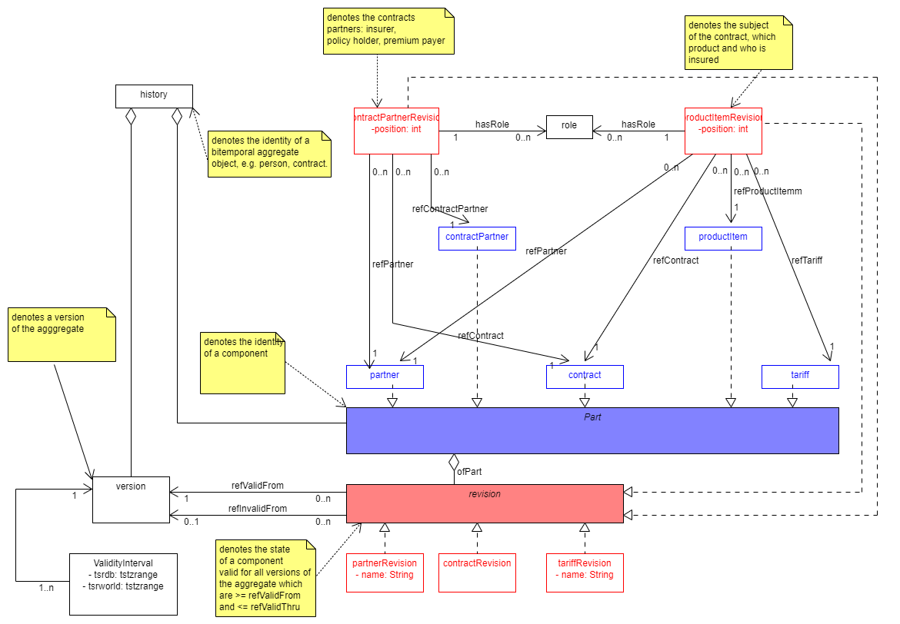

# A Julia template for Bitemporal Data Management based on SearchLight.jl

This package provides generic functions for CRUD of bitemporal aggregate entities.
Serializing and deserializing is provided by packages JSON and ToStruct.

The package's application based transaction logic comprises reified transactions such that
even pending transactions' data are persistent. Pending transactions can therefore be suspended, resumed
and delegated: passed between users within workflows.

## Twodimensional intervals representing panes of validity

Bitemporal data management models temporal references of data, such as

- a contract's begin of validity,i.e. from when on it shall be executed
- a contract's date of signature, or in a computational context: the timestamp of its final (committed) insertion into a database.

For instance, we agreed

* on Monday on s.th. we call the blue agreement beginning next year,
* on Tuesday on the yellow one beginning two years later, and
* on Wednesday on the red one instead, beginning already one year later
* and leave it at that.

Our model is to provide answers to questions like

"What did we think at *transaction time* what we agreed upon as of *referenced time*"

Reference time and transaction time can be seen as
constituting a point which is contained in a
rectangle of validity and thus identifies a version.

The first idea of this approach is spatial representation of the two temporal dimensions.
The above course of agreements would be described by sets of adjacent rectangles,
reference time running horizontally, transaction time vertically and versions eperesented by colour.


Let's denote these rectangles by 2dimensional intervals, where *lower* stands for the start time, which is included, and *upper* for the end time which is not included. *upper* = infinity stands for an unspecified end time. We shall use use *v* to denote the version, i.e. the state of the object's attribute values that persists in the interval of validity.

While under this interpretation

* the first dimension allows references to past or future points in time just as human language does,
* the second dimension allows
  * only references to the past for *lower* as for the assertion to even exist in the data base it must have been entered at some past point of time; and
  * references to the past and to infinity for *upper* as the time of its revocation can be past as well as yet unspecified.

```math
[d_{lower}, d_{upper}) [w_{lower},w_{upper})
```

The first, blue, part in the above example is open ended in both dimensions, no end of world validity is intended and no mutation of the data base has been done yet,

```math
(v_{blue},[d_{lower},∞ ),[w_{lower},∞) )
```

The second part, the transition to yellow can be denoted like so:

```math
\begin{aligned}
&\text{let} \\
&s_{0} = { (v_{blue},[d_{0},∞ ),[w_{0},∞ ) ) } \\
&t_{1} = (d_{1},w_{1}) \\ 
&\text{where } d_{1} > d_{0}, w_{1} > w_{0} \\
&\text{then mutation of } s_{0} \text{ to yellow per }  t_{1} \text{ equals} \\
\{ &( v_{blue}, [d_{0}, d_{1}), [w_{0},∞), [d_{1},∞), [w_{0},w_{1}) ),\\
& ( v_{yellow}, [d_{1},∞), [w_{1}, ∞) )\}
\end{aligned}
```

The third part, the mutation overwriting yellow with red, can be denoted like so:

```math
\begin{aligned}
&\text{let} \\
&s_{1} =  \{( v_{blue}, [d_{0}, d_{1}), [w_{0},∞), [d_{1},∞), [w_{0},w_{1}) ), ( v_{yellow}, [d_{1},∞), [w_{1}, ∞) )\}\\
&t_{2} = (d_{2},w_{2})\\
&\text{where } d_{2} > d_{1}, w_{2} < w_{1} \\
&\text{then mutation of } s_{1} \text{ to red per }  t_{1} \text{ equals} \\
\end{aligned} \\
\begin{aligned}
\{ &( v_{blue}, [d_{0},d_{1}) [w_{0},∞) [d_{1},d_{2}) [w_{0},w_{1}) [d_{2},∞) [w_{0},w_{2}) ),\\
   &( v_{yellow}, [d_{1},d_{2},) [w_{1},∞) ),\\
   & ( v_{red}, [d_{2},∞) [w_{2},∞) ) \}
\end{aligned}
```

## Representing bitemporal aggregations

When we look at bitemporal aggregates we find components that can change independently at different times, like for instance an insurance contract with subobjects like a reference to the premium payer, tariff parameters like height of premium, modes of payment, date of last payment etc.etc..
Thus we find that these subobjects need their own intervals of validity; but because the aggregate changes whenever a component changes, the aggregate version can share its intervals with the changing components. Let's enhance our example such that we have three components of which

* one is added at creation as of the blue version of the aggregate, but deleted as of the yellow one
* another added at creation as of the yellow version of the aggregate, but deleted as of the red one and
* a third, is added at creation as of the blue version of the aggregate, and kept as of the yellow and red versions

```math
\begin{aligned}
h = \{&( v_{blue}, [d_{0},d_{1}) [w_{0},∞) [d_{1},d_{2}) [w_{0},w_{1}) [d_{2},∞) [w_{0},w_{2}) ),\\
      &( v_{yellow}, [d_{1},d_{2},) [w_{1},∞) ),\\
      &( v_{red}, [d_{2},∞) [w_{2},∞) ) \}\\
\\
c_{i} =& ( v_{blue}, [d_{0},d_{1}) [w_{0},∞) [d_{1},d_{2}) [w_{0},w_{1}) [d_{2},∞) [w_{0},w_{2}) )\\
c_{2} =& ( v_{yellow}, [d_{1},d_{2},) [w_{1},∞) )\\
c_{3} =& ( v_{blue}, [d_{0},d_{1}) [w_{0},∞) [d_{1},d_{2}) [w_{0},w_{1}) [d_{2},∞) [w_{0},w_{2}) )( v_{yellow}, [d_{1},d_{2},) [w_{1},∞)(v_{red}, [d_{2},∞) [w_{2},∞) )
\end{aligned}
```

This can be simplified by substituting the interval sets by references to the versions they are shared with.

```math
\begin{aligned}
h = \{&( v_{blue}, [d_{0},d_{1}) [w_{0},∞) [d_{1},d_{2}) [w_{0},w_{1}) [d_{2},∞) [w_{0},w_{2}) ),\\
      &( v_{yellow}, [d_{1},d_{2},) [w_{1},∞) ),\\
      &( v_{red}, [d_{2},∞) [w_{2},∞) ) \} \\
c_{i} =& ( v_{blue})\\
c_{2} =& ( v_{yellow} )\\
c_{3} =& ( v_{blue}, v_{yellow}, v_{red})
\end{aligned}
```

This is syntactic sugar, but looks better to a programmer, who fears redundancy. But better still  this notation suggests another simplification, by using ranges of versions. Sets of subsequent, contingent (no holes in between) versions can be represented by ranges with the creating version as *lower* and the invalidating version as *upper* bound . For the intervals of components that persist,i.e. are not invalidated by a subsequent version, we introduce a pseudo version ∞, which is the greatest upper bound and denotes not invalidated by an exisiting version. This is another joy for the programmer, because creating new versions of the aggregate can be done without updating the upper bounds of intervals of unchanged components.

```math
\begin{aligned}
h = \{ &( v_{blue}, [d_{0},d_{1}) [w_{0},∞) [d_{1},d_{2}) [w_{0},w_{1}) [d_{2},∞) [w_{0},w_{2}) ),\\
      &( v_{yellow}, [d_{1},d_{2},) [w_{1},∞) ),\\
      &( v_{red}, [d_{2},∞) [w_{2},∞) ) \}\\
c_{i} =& [v_{blue},v_{yellow})\\
c_{2} =& [v_{yellow},v_{red})\\
c_{3} =& [v_{blue}, v_{∞})
\end{aligned}
```

## Bitemporal Transactions

### Transaction data, commits and rollbacks

Transactions here are application based. A transaction is identified by a version and transaction data that depend on it.

**Beginning a transaction** on a bitemporal aggregate now as of a date of reference w means

* to create a version object and
* an interval of validity labelled as not committed and

```math
\hspace*{10mm} validity = [now,∞) [w,∞)
```

**Mutations of components** consist of

* new revisions of components that are marked as valid from the new version on and invalid from infinity on and
* previous revisions of mutated or deleted components that are marked as invalid from the new version on.

**Backing out** of a bitemporal transaction consists of

* deleting the version instance and its depending data:
  * the uncommitted interval
  * new revisions of components, which are marked as valid from the backed out version on and
  * resetting the "invalid from" marks of mutated revisions back to infinity(maxVersion)

**Committing**  a version consists of

* labelling its interval of validity as committed
* and managing shadowing and overlapping of its interval
  of validity with those of previous versions as is described in above examples.

### Locking

Application defined locking is based on a constraint that per entity only one interval with state uncommitted may exist.

### Reified transactions and workflow

As transactions in this framework are first class data they can be utilized for workflow control:

* As results of transactionaal operations are persisted immediately, they existence does not depend on the process they are initiated in. The process can be ended before commit and the workflow can resumed later in another process.
* With concepts of _ownership of workflow_ and _state of work_ added, transactions with _state of work = suspended_ marked can  be delegated between owners by suspending and resuming in their respective processes.

## GiST indexing in POSTGRES for search and guarding bitemporal uniqueness

Database access to bitemporal objects can be supported by GiST (Generalized Search Tree) indices on our

* timestamp-intervals for database and world validity as well as
* revision intervals

So in POSTGRES, for example - hava a look at the UML-Diagram below - , we can access a component (with table name *PART*) by a simple join with filters for

* to locate a history's version by timestamps'inclusion in validity intervals and
* a *PART*'s revision by the version id's inclusion in the *PART_REVISION*'s range of valid versions.

```@raw html
<pre><code>SELECT * FROM histories h
JOIN version v ON v.ref_history = h.id
JOIN validity_interval i ON i.ref_version = v.id 
JOIN <i>PART</i> p ON p.ref_history
JOIN <i>PART_REVISION</i> r ON r.ref_<i>PART</i> = p.id AND r.validity_range  @> v.id
WHERE h.id = :history_id and p.id = :part_id AND i.tsr_world @> TIMESTAMPTZ:ts_world and i.tsr_db @> TIMESTAMPTZ :ts_db
</code></pre>
```

POSTGRES also provides uniqueness constraints for GIST-indices, so that we can guarantee for every history, that its versions validity_intervals are unique, that is non overlapping. Inserting an overlapping interval fails constraint violation exception.

```@raw html
<pre><code>ADD CONSTRAINT bitemp EXCLUDE USING GIST (ref_version WITH =, is_committed WITH =, tsrworld WITH &&, tsrdb WITH &&)`
</code></pre>
```

# A first sketch of a bitemporal UML model for insurance contracts



Please compare:
https://hdombrovskaya.wordpress.com/2019/07/14/lets-go-bitemporal/
https://www.postgresql.eu/events/pgdayparis2019/sessions/session/2291/slides/171/pgdayparis_2019_msedivy_bitemporality.pdf
